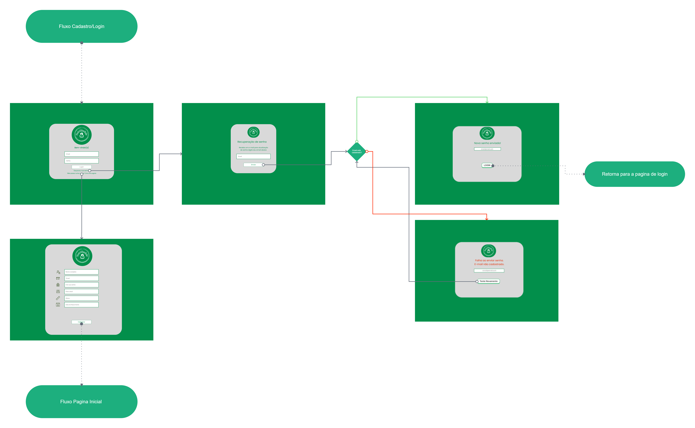
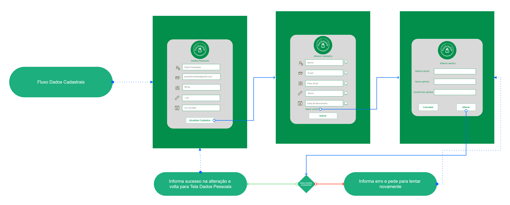
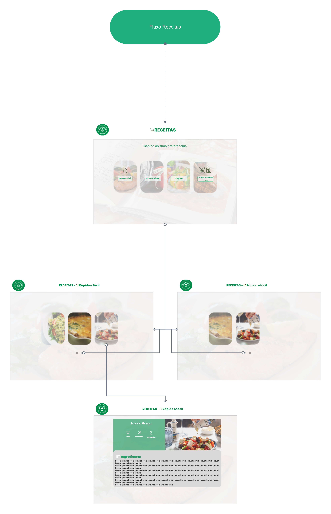
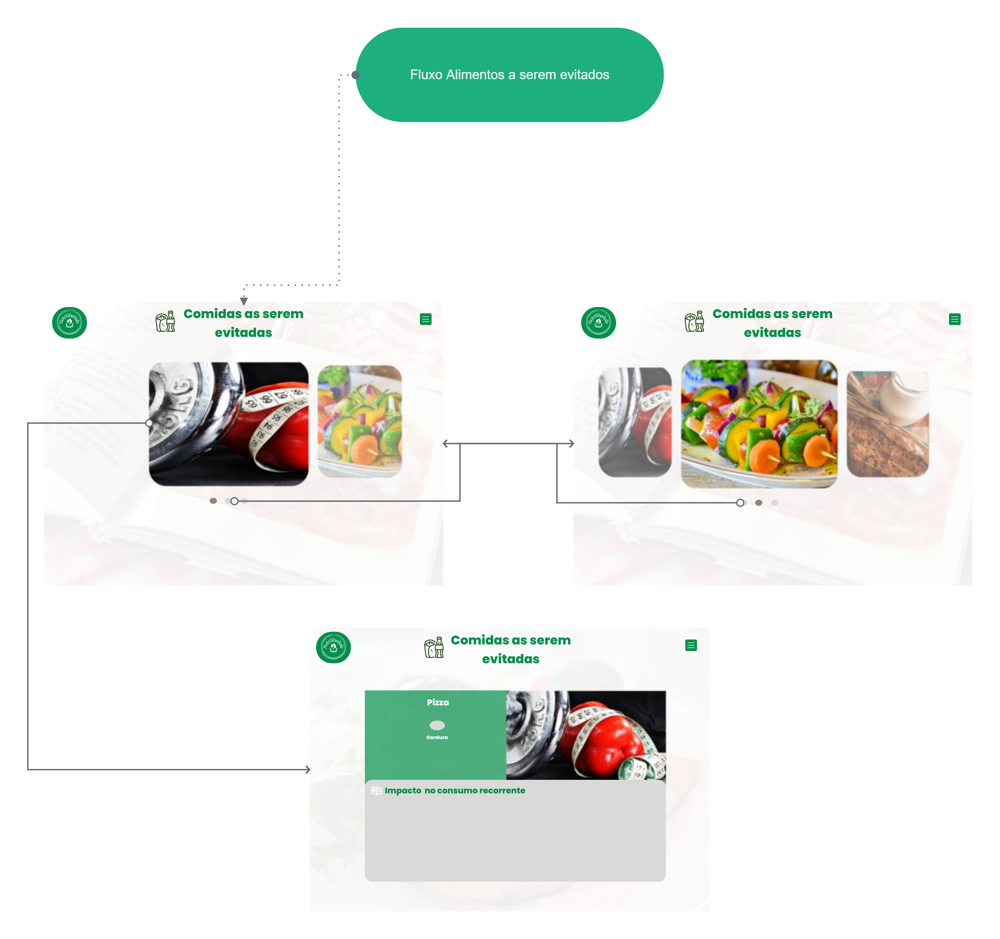

# Projeto de Interface

Visão geral da interação do usuário pelas telas do sistema e protótipo interativo das telas com as funcionalidades que fazem parte do sistema (wireframes).

 Apresente as principais interfaces da plataforma. Discuta como ela foi elaborada de forma a atender os requisitos funcionais, não funcionais e histórias de usuário abordados nas <a href="2-Especificação do Projeto.md"> Documentação de Especificação</a>.

## User Flow

### Menu principal

### Login/Cadastro

### Dados Pessoais

### Receitas

### Alimentos não recomendados

### Informacoes Nutricionais

---

Fluxo de usuário (User Flow) é uma técnica que permite ao desenvolvedor mapear todo fluxo de telas do site ou app. Essa técnica funciona para alinhar os caminhos e as possíveis ações que o usuário pode fazer junto com os membros de sua equipe.

> **Links Úteis**:
> - [User Flow: O Quê É e Como Fazer?](https://medium.com/7bits/fluxo-de-usu%C3%A1rio-user-flow-o-que-%C3%A9-como-fazer-79d965872534)
> - [User Flow vs Site Maps](http://designr.com.br/sitemap-e-user-flow-quais-as-diferencas-e-quando-usar-cada-um/)
> - [Top 25 User Flow Tools & Templates for Smooth](https://www.mockplus.com/blog/post/user-flow-tools)

## Wireframes

### Home

A página inicial é a principal entrada da plataforma, responsável por prover informações gerais sobre o objetivo da plataforma e dar acesso a outras páginas incluíndo páginas Connheça os alimentos, Registre suas refeições, Receitas para o dia a dia,Conheça os alimentos, Você conhece os alimentos que devem ser evitados?, Login e Cadastro. Nesta página o usuário também acessa o cálculo do IMC (RF- à RF-).

________________________________________________________________________________________________________________________________________________________
### Cálculo do IMC

Na página **Cálculo do IMC**, o usuário irá realizar o cálculo do Índice de Massa Corporal. (RF-004)

### Registre suas refeições

Ná página **Registre suas refeições**, o usuário irá cadastrar os alimentos ingeridos ao logo do dia e poderá gerar uma relatório dos dados cadastrados. Também terá acesso a sugestão de ingestão diária de àgua.  (RF-003 | RF-010 | RF-011)

________________________________________________________________________________________________________________________________________________________
### Conheça os Alimentos

Na página **Conheça os Alimentos**, o usuário terá acesso as informações sobre os tipos de grupos de alimentos. (RF-007)

________________________________________________________________________________________________________________________________________________________
### Receitas do dia dia

Na página **Receitas do dia dia**, o usuário terá acesso as receitas separadas por preferências: Rápido e fácil, Fit e saudável, Vegana e Gluteen e lactose free. (RF-001 | RF-002 | RF-006)

________________________________________________________________________________________________________________________________________________________
### Alimentos que devem ser evitados

Na página **Você conhece os alimentos que devem ser evitados?**, o usuário terá acesso a informações sobre alimentos que são prejuduciais a saúde. (RF-005)

_______________________________________________________________________________________________________________________________________________________
### Páginas protegidas

As páginas acima são protegidas por autenticação, assim a plataforma prove meios para criação e gerenciamento de conta, login e recuperação de senha por meio de formulários modernos e intuitívos. (RF-008 | RF-009)  

________________________________________________________________________________________________________________________________________________________

São protótipos usados em design de interface para sugerir a estrutura de um site web e seu relacionamentos entre suas páginas. Um wireframe web é uma ilustração semelhante do layout de elementos fundamentais na interface.

### Exemplo

A tela Inicial apresenta um menu lateral com as principais seções do portal, enquanto a navigation bar, ao topo, apresenta informações de envio de imagens ou navegação pela galeria de fotos. A área central apresenta a galeria de fotos na forma de uma grade.

 
> **Links Úteis**:
> - [Protótipos vs Wireframes](https://www.nngroup.com/videos/prototypes-vs-wireframes-ux-projects/)
> - [Ferramentas de Wireframes](https://rockcontent.com/blog/wireframes/)
> - [MarvelApp](https://marvelapp.com/developers/documentation/tutorials/)
> - [Figma](https://www.figma.com/)
> - [Adobe XD](https://www.adobe.com/br/products/xd.html#scroll)
> - [Axure](https://www.axure.com/edu) (Licença Educacional)
> - [InvisionApp](https://www.invisionapp.com/) (Licença Educacional)
