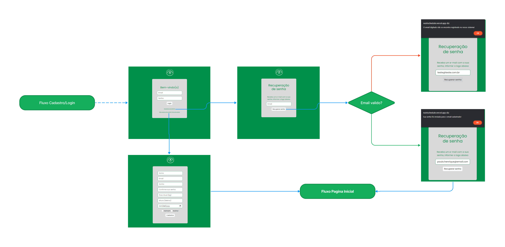

# Projeto de Interface

Visão geral da interação do usuário pelas telas do sistema e protótipo interativo das telas com as funcionalidades que fazem parte do sistema (wireframes).

________________________________________________________________________________________________________________________________________________________

## Wireframes

### Home

A tela principal da plataforma, apresentada pela Figura 1, é a primeira entrada para o usuário e é projetada para ajudá-lo a entender rapidamente o que a plataforma oferece e como ela pode ajudá-lo a alcançar seus objetivos. Para isso, a tela utiliza elementos visuais claros e de fácil leitura, como títulos e imagens, além de informações concisas sobre os recursos da plataforma.
Além disso, a tela inicial facilita o acesso aos recursos mais importantes da plataforma, como "Registre suas refeições" (RF-003 | RF-010 | RF-011), "Receitas para o dia a dia" (RF-001 | RF-002 | RF-007), "Conheça os alimentos" (RF-006), "Você conhece os alimentos que devem ser evitados?" (RF-005), "Login" e "Cadastro" (RF-008 | RF-009). Esses recursos são disponibilizados por meio de botões ou links de fácil acesso, aumentando a probabilidade do usuário explorar mais a plataforma e utilizar seus recursos para alcançar seus objetivos de saúde e bem-estar.
Por fim, na tela inicial, o usuário também pode acessar o cálculo do IMC (RF-004), o que pode ser uma ferramenta importante para monitorar sua saúde.

Figura 1 - Tela Principal

________________________________________________________________________________________________________________________________________________________
### Cálculo do IMC

Na tela de **Cálculo do IMC** , o usuário poderá inserir seu peso e altura e, em seguida, realizar o cálculo do Índice de Massa Corporal (IMC), que é uma medida que relaciona o peso e a altura de uma pessoa. O IMC é amplamente utilizado para avaliar se uma pessoa está dentro do peso considerado saudável, com base em sua altura.
Além disso, a tela pode fornece informações adicionais sobre o significado dos diferentes valores de IMC e como eles podem afetar a saúde. Por exemplo, um IMC abaixo do peso pode estar associado a riscos de desnutrição, enquanto um IMC elevado pode estar relacionado a problemas de saúde como diabetes, hipertensão e doenças cardíacas.
A tela de **cálculo do IMC** é uma ferramenta útil para ajudar os usuários a monitorar sua saúde e adotar medidas preventivas (RF-004).

### Registre suas refeições

A tela **Registre suas refeições** permite que o usuário cadastre os alimentos que ingeriu ao longo do dia e possa gerar um relatório dos dados cadastrados. Sendo uma ferramenta útil para quem deseja monitorar sua ingestão calórica e nutricional, além de identificar padrões alimentares e possíveis desequilíbrios na dieta.
Além disso, na tela o usuário também terá acesso a sugestões de ingestão diária de água, o que pode ser uma ajuda importante para manter uma hidratação adequada. É importante lembrar que a água é essencial para diversas funções do organismo e que a falta dela pode levar a problemas de saúde.
A tela **Registre suas refeições** é uma ferramenta importante para quem deseja adotar hábitos alimentares saudáveis e monitorar sua saúde (RF-003 | RF-010 | RF-011).

________________________________________________________________________________________________________________________________________________________
### Conheça os Alimentos

Na tela **Conheça os Alimentos** , o usuário terá acesso a informações sobre os diferentes tipos de grupos de alimentos e suas características nutricionais. Sendo uma ferramenta útil para quem deseja aprender mais sobre nutrição e fazer escolhas alimentares mais saudáveis.
Entre os grupos de alimentos abordados na tela estão os carboidratos, as proteínas, as gorduras, as vitaminas e os minerais. O usuário poderá aprender sobre as funções de cada grupo no organismo, bem como as principais fontes alimentares de cada nutriente.
Além disso, a tela "Conheça os Alimentos" pode ser útil para quem precisa adequar sua dieta a alguma condição de saúde específica, como diabetes, hipertensão ou intolerância a lactose. Isso porque as informações disponíveis na tela podem ajudar o usuário a escolher alimentos mais adequados às suas necessidades nutricionais.
A tela "Conheça os Alimentos" pode ser uma ferramenta importante para quem deseja aprender mais sobre nutrição e fazer escolhas alimentares mais saudáveis e adequadas às suas necessidades individuais. 
 (RF-006).

________________________________________________________________________________________________________________________________________________________
### Receitas do dia dia

A tela **Receitas do dia dia**, o usuário terá acesso as receitas separadas por preferências: Rápido e fácil, Fit e saudável, Vegana e Gluteen e lactose free (RF-001 | RF-002 | RF-007).

Na categoria **Rápido e fácil**, serão apresentadas receitas que podem ser preparadas de forma rápida e simples, sem exigir muito tempo ou habilidades culinárias complexas. Estas receitas são ideais para quem tem pouco tempo disponível para cozinhar ou para quem está começando a se aventurar na cozinha.

Na categoria **Fit e saudável**, serão apresentadas receitas com ingredientes nutritivos e saudáveis, adequados para quem busca uma alimentação equilibrada e saudável. Estas receitas podem incluir opções de baixo teor de gordura, ricas em proteínas ou com baixo teor de carboidratos, por exemplo.

Na categoria **Vegana**, serão apresentadas receitas livres de produtos de origem animal, adequadas para quem segue uma dieta vegana. Estas receitas podem incluir opções com proteínas vegetais, como tofu, seitan ou legumes, por exemplo.

Por fim, na categoria **Glúten e lactose free**, serão apresentadas receitas que não contêm glúten ou lactose, adequadas para pessoas com intolerância ou sensibilidade a estes componentes. Estas receitas podem incluir opções com farinhas sem glúten, como a de arroz ou de mandioca, ou substitutos para o leite, como o leite de amêndoas ou o leite de soja, por exemplo.

________________________________________________________________________________________________________________________________________________________
### Alimentos que devem ser evitados

A tela **Você conhece os alimentos que devem ser evitados?**, fornecerá informações sobre alimentos prejudiciais à saúde (RF-005).

Existem muitos alimentos que, se consumidos em excesso ou de forma inadequada, podem ser prejudiciais à saúde. Saber quais são esses alimentos e como evitá-los pode ajudar a prevenir uma série de doenças crônicas, como obesidade, diabetes, doenças cardíacas e câncer.

 
 
 
 

_______________________________________________________________________________________________________________________________________________________
### Telas protegidas

As telas acima são protegidas por autenticação, e a plataforma oferece meios para criação e gerenciamento de contas, login e recuperação de senha por meio de formulários modernos e intuitivos (RF-008 | RF-009).

________________________________________________________________________________________________________________________________________________________

## User Flow

### Menu principal

### Login/Cadastro

### Dados Pessoais

### Receitas

### Alimentos não recomendados

### Informacoes Nutricionais

---

