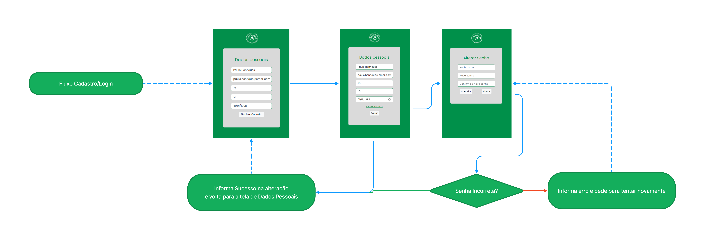

# Projeto de Interface

Visão geral da interação do usuário pelas telas do sistema e protótipo interativo das telas com as funcionalidades que fazem parte do sistema (wireframes).

________________________________________________________________________________________________________________________________________________________

## Wireframes

### Home

A tela principal da plataforma, apresentada pela Figura 1, é a primeira entrada para o usuário e é projetada para ajudá-lo a entender rapidamente o que a plataforma oferece e como ela pode ajudá-lo a alcançar seus objetivos. Para isso, a tela utiliza elementos visuais claros e de fácil leitura, como títulos e imagens, além de informações concisas sobre os recursos da plataforma.
Além disso, a tela inicial facilita o acesso aos recursos mais importantes da plataforma, como "Registre suas refeições" [(RF-004 | RF-011 | RF-012)](especification.md#requisitos), "Receitas para o dia a dia" [(RF-002 | RF-003 | RF-007 |RF-013 | RF-014)](especification.md#requisitos), "Conheça os alimentos" [(RF-008)](especification.md#requisitos), "Você conhece os alimentos que devem ser evitados?" [(RF-006)](especification.md#requisitos), "Login" e "Cadastro" [( RF-001 | RF-009 | RF-010)](especification.md#requisitos). Esses recursos são disponibilizados por meio de botões ou links de fácil acesso, aumentando a probabilidade do usuário explorar mais a plataforma e utilizar seus recursos para alcançar seus objetivos de saúde e bem-estar.
Por fim, na tela inicial, o usuário também pode acessar o cálculo do IMC [(RF-005)](especification.md#requisitos), o que pode ser uma ferramenta importante para monitorar sua saúde.

  Figura 1 - Tela Principal

________________________________________________________________________________________________________________________________________________________
### Cálculo do IMC

Na tela de **Cálculo do IMC**, ilustrada pela Figura 2, o usuário poderá inserir seu peso e altura e, em seguida, realizar o cálculo do Índice de Massa Corporal (IMC), que é uma medida que relaciona o peso e a altura de uma pessoa. O IMC é amplamente utilizado para avaliar se uma pessoa está dentro do peso considerado saudável, com base em sua altura.
Além disso, a tela pode fornece informações adicionais sobre o significado dos diferentes valores de IMC e como eles podem afetar a saúde. Por exemplo, um IMC abaixo do peso pode estar associado a riscos de desnutrição, enquanto um IMC elevado pode estar relacionado a problemas de saúde como diabetes, hipertensão e doenças cardíacas.
A tela de **cálculo do IMC** é uma ferramenta útil para ajudar os usuários a monitorar sua saúde e adotar medidas preventivas [(RF-005)](especification.md#requisitos).

   Figura 2 - Cálculo do IMC

### Registre suas refeições

A tela **Registre suas refeições** permite que o usuário cadastre os alimentos que ingeriu ao longo do dia e possa gerar um relatório dos dados cadastrados. Sendo uma ferramenta útil para quem deseja monitorar sua ingestão calórica e nutricional, além de identificar padrões alimentares e possíveis desequilíbrios na dieta.
Além disso, na tela o usuário também terá acesso a sugestões de ingestão diária de água, o que pode ser uma ajuda importante para manter uma hidratação adequada. É importante lembrar que a água é essencial para diversas funções do organismo e que a falta dela pode levar a problemas de saúde.
A tela **Registre suas refeições** é uma ferramenta importante para quem deseja adotar hábitos alimentares saudáveis e monitorar sua saúde [(RF-004 | RF-011 | RF-012)](especification.md#requisitos).

  Figura 3 - Registro dos alimentos

________________________________________________________________________________________________________________________________________________________
### Conheça os Alimentos

Na tela **Conheça os Alimentos**, exibida pela Figura 3,  o usuário terá acesso a informações sobre os diferentes tipos de grupos de alimentos e suas características nutricionais. Sendo uma ferramenta útil para quem deseja aprender mais sobre nutrição e fazer escolhas alimentares mais saudáveis.
Entre os grupos de alimentos abordados na tela estão os carboidratos, as proteínas, as gorduras, as vitaminas e os minerais. O usuário poderá aprender sobre as funções de cada grupo no organismo, bem como as principais fontes alimentares de cada nutriente.
Além disso, a tela "Conheça os Alimentos" pode ser útil para quem precisa adequar sua dieta a alguma condição de saúde específica, como diabetes, hipertensão ou intolerância a lactose. Isso porque as informações disponíveis na tela podem ajudar o usuário a escolher alimentos mais adequados às suas necessidades nutricionais.
A tela "Conheça os Alimentos" pode ser uma ferramenta importante para quem deseja aprender mais sobre nutrição e fazer escolhas alimentares mais saudáveis e adequadas às suas necessidades individuais. 
 [(RF-008)](especification.md#requisitos).

  Figura 4 - Informações alimentares

________________________________________________________________________________________________________________________________________________________
### Receitas

Na interface **"Receitas"**, mostrada na Figura 4, serão exibidas diversas receitas culinárias. Cada receita estará associada a ícones que fornecem informações sobre sua classificação específica em relação a restrições alimentares, tais como **glúten free, lactose free ou vegana.** Esses ícones têm o propósito de permitir aos usuários identificar prontamente as receitas que atendem às suas necessidades e preferências dietéticas. Além disso, os usuários terão a capacidade de realizar avaliações das receitas. Isso permitirá que compartilhem suas opiniões e experiências com outros usuários, contribuindo para a comunidade e auxiliando na escolha das melhores receitas. As avaliações podem incluir notas e comentários. Essa funcionalidade interativa promoverá a troca de conhecimento e aprimoramento contínuo das receitas disponíveis na plataforma. A aplicação calculará a média das avaliações, permitindo que os usuários tenham uma visão geral da qualidade e popularidade de cada receita com base nas opiniões dos outros usuários. Essa funcionalidade interativa promoverá a troca de conhecimento e aprimoramento contínuo das receitas disponíveis na plataforma. Os usuários poderão confiar nas avaliações coletadas pela aplicação para tomar decisões informadas ao escolherem as receitas a serem preparadas. [(RF-002 | RF-003 | RF-007 |RF-013 | RF-014)](especification.md#requisitos).

   Figura 5 - Receitas

________________________________________________________________________________________________________________________________________________________
### Alimentos que devem ser evitados

A tela **Você conhece os alimentos que devem ser evitados?**, verificada na Figura 5, fornecerá informações sobre alimentos prejudiciais à saúde [(RF-006)](especification.md#requisitos).

Existem muitos alimentos que, se consumidos em excesso ou de forma inadequada, podem ser prejudiciais à saúde. Saber quais são esses alimentos e como evitá-los pode ajudar a prevenir uma série de doenças crônicas, como obesidade, diabetes, doenças cardíacas e câncer.

 

  

 

   Figura 6 - Alimentos que devem ser evitados

 

_______________________________________________________________________________________________________________________________________________________
### Telas protegidas

As telas acima são protegidas por autenticação, e a plataforma oferece meios para criação e gerenciamento de contas, login e recuperação de senha por meio de formulários modernos e intuitivos [(RF-001 | RF-009 | RF-010)](especification.md#requisitos), conforme apresenta a Figura 6.

   Figura 7 - Telas protegidas

________________________________________________________________________________________________________________________________________________________

## User Flow

### Menu principal

### Login/Cadastro

### Dados Pessoais

### Receitas

### Alimentos não recomendados

### Informacoes Nutricionais

---

