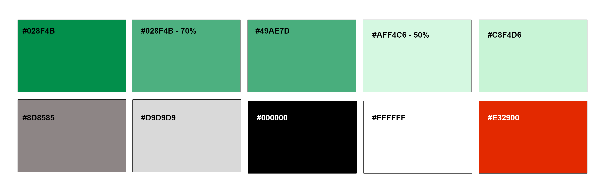
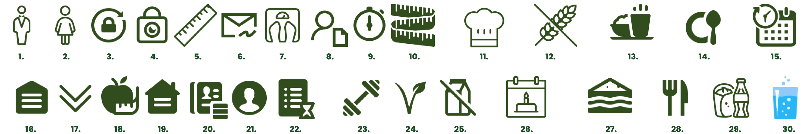

# Template padrão do site

Layout padrão do site (HTML e CSS) que será utilizado em todas as páginas com a definição de identidade visual, aspectos de responsividade e iconografia.

Explique as guias de estilo utilizadas no seu projeto.

## Design

Detalhe os layouts que serão utilizados. Apresente onde será colocado o logo do sistema. Defina os menus padrões, entre outras coisas.


<details>
  <summary>Header/Nav Bar</summary>

  ```html
  <header>
      <nav class="navbar sticky-top">
        <div class="container-fluid">
            <a class="navbar-brand" href="#">
                
            </a>
            <ul class="nav justify-content-center nav-fluid-content">
              <li class="nav-item">
                <a class="nav-link link-success" aria-current="page" href="#">Registro Alimentar</a>
              </li>
              <li class="nav-item">
                <a class="nav-link link-success" href="#">Informações dos Alimentos</a>
              </li>
              <li class="nav-item">
                  <a class="nav-link link-success" href="#">Receitas</a>
              </li>
              <li class="nav-item">
                  <a class="nav-link link-success" href="#">Alimentos não recomendados</a>
              </li>
            </ul>
          <button class="navbar-toggler" type="button" data-bs-toggle="offcanvas" data-bs-target="#offcanvasDarkNavbar" aria-controls="offcanvasDarkNavbar" aria-label="Toggle navigation">
            <span class="navbar-toggler-icon"></span>
          </button>
          <div class="offcanvas offcanvas-end text-bg-dark bg-success" tabindex="-1" id="offcanvasDarkNavbar" aria-labelledby="offcanvasDarkNavbarLabel">
            <div class="offcanvas-header">
              <i class="bi bi-person-circle"></i>
              <h5 class="offcanvas-title" id="offcanvasDarkNavbarLabel">Login</h5>
              <button type="button" class="btn-close btn-close-white" data-bs-dismiss="offcanvas" aria-label="Close"></button>
            </div>
            <div class="offcanvas-body">
              <ul class="navbar-nav justify-content-end flex-grow-1 pe-3 ">
                <li class="nav-item">
                    <a class="nav-link link-success" href="#">Calculo IMC</a>
                </li>
                <li class="nav-item nav-fluid-content-canvas">
                    <a class="nav-link link-success" href="#">Registro Alimentar</a>
                </li>
                <li class="nav-item nav-fluid-content-canvas">
                    <a class="nav-link link-success" href="#">Informações dos Alimentos</a>
                </li>
                <li class="nav-item nav-fluid-content-canvas">
                    <a class="nav-link link-success" href="#">Receitas</a>
                </li>
                <li class="nav-item nav-fluid-content-canvas">
                    <a class="nav-link link-success" href="#">Alimentos não recomendados</a>
                </li>
              </ul>
            </div>
          </div>
        </div>
      </nav>
    </header>
  ```
</details>

---------------------


<details>
  <summary>Footer</summary>

  ```html
  <header>
      <nav class="navbar sticky-top">
        <div class="container-fluid">
            <a class="navbar-brand" href="#">
                
            </a>
            <ul class="nav justify-content-center nav-fluid-content">
              <li class="nav-item">
                <a class="nav-link link-success" aria-current="page" href="#">Registro Alimentar</a>
              </li>
              <li class="nav-item">
                <a class="nav-link link-success" href="#">Informações dos Alimentos</a>
              </li>
              <li class="nav-item">
                  <a class="nav-link link-success" href="#">Receitas</a>
              </li>
              <li class="nav-item">
                  <a class="nav-link link-success" href="#">Alimentos não recomendados</a>
              </li>
            </ul>
          <button class="navbar-toggler" type="button" data-bs-toggle="offcanvas" data-bs-target="#offcanvasDarkNavbar" aria-controls="offcanvasDarkNavbar" aria-label="Toggle navigation">
            <span class="navbar-toggler-icon"></span>
          </button>
          <div class="offcanvas offcanvas-end text-bg-dark bg-success" tabindex="-1" id="offcanvasDarkNavbar" aria-labelledby="offcanvasDarkNavbarLabel">
            <div class="offcanvas-header">
              <i class="bi bi-person-circle"></i>
              <h5 class="offcanvas-title" id="offcanvasDarkNavbarLabel">Login</h5>
              <button type="button" class="btn-close btn-close-white" data-bs-dismiss="offcanvas" aria-label="Close"></button>
            </div>
            <div class="offcanvas-body">
              <ul class="navbar-nav justify-content-end flex-grow-1 pe-3 ">
                <li class="nav-item">
                    <a class="nav-link link-success" href="#">Calculo IMC</a>
                </li>
                <li class="nav-item nav-fluid-content-canvas">
                    <a class="nav-link link-success" href="#">Registro Alimentar</a>
                </li>
                <li class="nav-item nav-fluid-content-canvas">
                    <a class="nav-link link-success" href="#">Informações dos Alimentos</a>
                </li>
                <li class="nav-item nav-fluid-content-canvas">
                    <a class="nav-link link-success" href="#">Receitas</a>
                </li>
                <li class="nav-item nav-fluid-content-canvas">
                    <a class="nav-link link-success" href="#">Alimentos não recomendados</a>
                </li>
              </ul>
            </div>
          </div>
        </div>
      </nav>
    </header>
  ```
</details>

--------


[Clique aqui para visualizar o exemplo interativo da aplicação](https://codepen.io/IFVN/embed/QWZOLzM?default-tab=result&theme-id=dark)


## Cores

Baseando-se na cor verde como principal além do branco, que está associda a saúde e vitalidade, foi criado a seguinte paleta de cores. 



A cor #028F4B foi usada como fundo nas telas de cadastro e login, do cálculo do IMC,  e da edição de dados do usuário afim de chamar mais atenção ao conteúdo central que faz as requisições e contém as informações importantes do usuário. Utilizando esta cor na fonte de maneira que atraia a atenção e combine de forma harmoniosa com a intenção do projeto. Na versão de #028F4B - 70% foi aplicado na tela de sobre receitas para destacar o nome, a dificuldade, o tempo de preparo e as porções. 

## Tipografia

Apresente as fontes que serão utilizadas e sua função no site. As principais funções são: Título de página, Título de Seção, Rótulos de componentes e Corpo de Texto.


## Iconografia




Os ícones 1, 2, 5 e 7 são utlizados na página de cálculo de IMC, os dois primeiros idicam o sexo que o usuário corresponde, o terceiro representa a altura e o quarto seu peso atual.

Na sequência os ícones 3, 4, 5, 6, 7, 8  e 26 foram empregados nas telas de cadastro e login, na de editar dados do usuário e na de dados pessoais como papel de representar o nome(8), email(6), data de nascimento(26), altura(5), peso(7), senha(4) e confirmação de senha(3).

E os ademais foram usados nas telas de sobre as receitas, e nas de informações nuticionais e de alimentos a serem evitados.

Apresente os estilos CSS criados para cada um dos elementos apresentados.
Outras seções podem ser adicionadas neste documento para apresentar padrões de componentes, de menus, etc.


> **Links Úteis**:
>
> -  [Como criar um guia de estilo de design da Web](https://edrodrigues.com.br/blog/como-criar-um-guia-de-estilo-de-design-da-web/#)
> - [CSS Website Layout (W3Schools)](https://www.w3schools.com/css/css_website_layout.asp)
> - [Website Page Layouts](http://www.cellbiol.com/bioinformatics_web_development/chapter-3-your-first-web-page-learning-html-and-css/website-page-layouts/)
> - [Perfect Liquid Layout](https://matthewjamestaylor.com/perfect-liquid-layouts)
> - [How and Why Icons Improve Your Web Design](https://usabilla.com/blog/how-and-why-icons-improve-you-web-design/)
