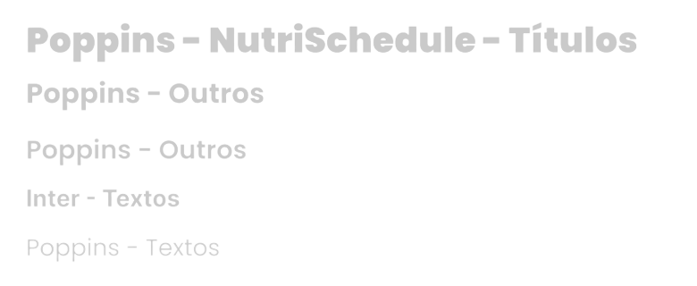
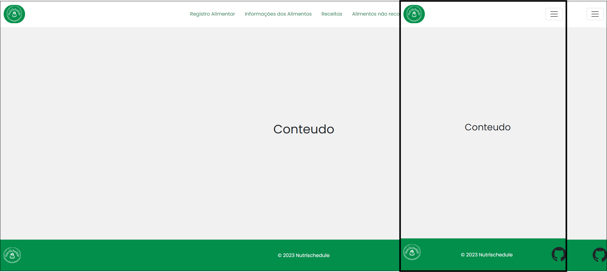
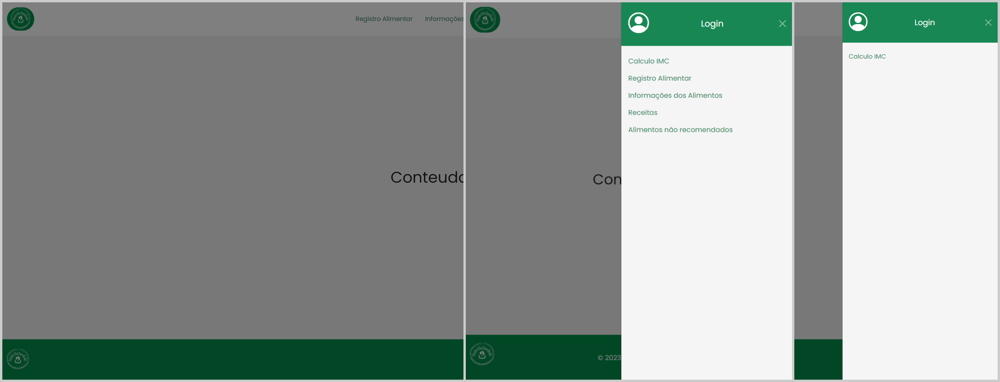
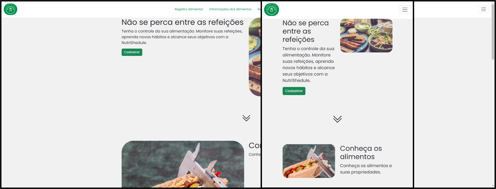

# Template padrão do site

## Cores
A saúde e vitalidade estão associadas a cor verde, o que endossa os objetivos da aplicação. Dessa forma, esta coloração é aderida como principal, assim como o branco que está relacionado à clareza e sugere equilíbrio interior.
Por conseguinte, a logo utiliza das premissas das cores principais para transmitir, de forma indireta, a finalidade do sistema.  


A cor `#028F4B` é utilizada como fundo das telas de cadastro e login, no cálculo do IMC e na edição de dados do usuário, a fim de destacar o conteúdo central que contém informações importantes. A cor está aplicada à fonte de forma a atrair a atenção dos usuários, bem como harmonizar com a intenção do projeto. Na versão `#028F4B` - 70%, a pigmentação é incorporada à tela de receitas para destacar o nome, a dificuldade, o tempo de preparo e as porções. 

O branco `#FFFFFF` é usado para estilizar os planos de fundo das telas iniciais, telas de receitas e informações nutricionais. Além disso, é configurado como cor principal para as caixas de respostas dos usuários nas telas de login, cadastro e cálculo do IMC.

A cor vermelha `#E32900` é aplicada nas fonte do texto presente na tela: "falha no envio do e-mail", para indicar que houve algum problema de verificação, o qual deve ser solucionado rapidamente para que o usuário possa ter acesso as demais áreas da aplicação.

A cor preta `#000000` é base de estilização de fonte nas telas que possuem descrições amplas, como as informações nutricionais e alimentos a serem evitados.

Os tons de cinza `#8D8585` e `#D9D9D9` são implementados nas fontes dos textos da tela inicial e, também como película das telas que contêm imagens no fundo.
  

## Tipografia

A fonte aplicada na criação das telas é a Poppins, uma tipografia geométrica clássica com aparência simples e equilibrada[[12]](./docs/references.md). Essa fonte tornou-se padrão em toda a aplicação web, presente em todas as telas com textos e títulos. A fonte secundária utilizada é a Inter, nas telas que incluem textos mais longos, como a de receitas.




## Iconografia


Os ícones 1, 2, 5 e 7 são utilizados na página de cálculo do IMC, sendo que os dois primeiros representam o sexo do usuário, o terceiro representa a altura e o quarto representa o peso atual.
Já os ícones 3, 4, 5, 6, 7, 8 e 26 são empregados nas telas de cadastro e login, edição de dados do usuário e informações pessoais, para representar respectivamente, o nome (8), e-mail (6), data de nascimento (26), altura (5), peso (7), senha (4) e confirmação de senha (3).
Os demais ícones são implementados nas telas de informações sobre as receitas, informações nutricionais e alimentos a serem evitados.

## Design

### Header


O header da aplicação se encontra presente em todas as telas, com exceção das seguintes:
- Cálculo IMC
- Cadastro/Gestão de dados

A barra de navegação contém um redirecionamento para as telas principais, sendo elas:
- Registro Alimentar
- Informações dos alimentos
- Receitas
- Alimentos não recomendados

A logo está localizada no canto superior esquerdo e serve como um redirecionamento para a página inicial, independentemente da tela em que o usuário esteja.

Se o dispositivo utilizado tiver uma largura pequena, os elementos de navegação ficarão ocultos e só poderão ser acessados ao clicar no ícone no canto superior direito.


<details>
  <summary>Header/Nav Bar</summary>

  ```html
  <header>
      <nav class="navbar sticky-top">
        <div class="container-fluid">
            <a class="navbar-brand" href="#">
                
            </a>
            <ul class="nav justify-content-center nav-fluid-content">
              <li class="nav-item">
                <a class="nav-link link-success" aria-current="page" href="#">Registro Alimentar</a>
              </li>
              <li class="nav-item">
                <a class="nav-link link-success" href="#">Informações dos Alimentos</a>
              </li>
              <li class="nav-item">
                  <a class="nav-link link-success" href="#">Receitas</a>
              </li>
              <li class="nav-item">
                  <a class="nav-link link-success" href="#">Alimentos não recomendados</a>
              </li>
            </ul>
          <button class="navbar-toggler" type="button" data-bs-toggle="offcanvas" data-bs-target="#offcanvasDarkNavbar" aria-controls="offcanvasDarkNavbar" aria-label="Toggle navigation">
            <span class="navbar-toggler-icon"></span>
          </button>
          <div class="offcanvas offcanvas-end text-bg-dark bg-success" tabindex="-1" id="offcanvasDarkNavbar" aria-labelledby="offcanvasDarkNavbarLabel">
            <div class="offcanvas-header">
              <i class="bi bi-person-circle"></i>
              <h5 class="offcanvas-title" id="offcanvasDarkNavbarLabel">Login</h5>
              <button type="button" class="btn-close btn-close-white" data-bs-dismiss="offcanvas" aria-label="Close"></button>
            </div>
            <div class="offcanvas-body">
              <ul class="navbar-nav justify-content-end flex-grow-1 pe-3 ">
                <li class="nav-item">
                    <a class="nav-link link-success" href="#">Calculo IMC</a>
                </li>
                <li class="nav-item nav-fluid-content-canvas">
                    <a class="nav-link link-success" href="#">Registro Alimentar</a>
                </li>
                <li class="nav-item nav-fluid-content-canvas">
                    <a class="nav-link link-success" href="#">Informações dos Alimentos</a>
                </li>
                <li class="nav-item nav-fluid-content-canvas">
                    <a class="nav-link link-success" href="#">Receitas</a>
                </li>
                <li class="nav-item nav-fluid-content-canvas">
                    <a class="nav-link link-success" href="#">Alimentos não recomendados</a>
                </li>
              </ul>
            </div>
          </div>
        </div>
      </nav>
    </header>
  ```
</details>

---------------------
### Footer

A logo da aplicação está presente no canto inferior esquerdo e funciona como um redirecionamento para a tela inicial ao ser clicada, porém, nas seguintes telas abaixo ele não é visível:
- Cálculo IMC
- Cadastro/Gestão de dados


<details>
  <summary>Footer</summary>

  ```html
  <footer class="d-flex flex-wrap justify-content-between align-items-center py-3 border-top">
      <div class="col-md-4 d-flex align-items-center">
        <a href="/" class="mb-3 me-2 mb-md-0 text-body-secondary text-decoration-none lh-1">
          
        </a>
      </div>
      <div>
        <span class="mb-3 mb-md-0 text-light">© 2023 Nutrischedule</span>
      </div>  
      <ul class="nav col-md-4 justify-content-end list-unstyled d-flex">
        <li class="ms-3">
            <i class="bi bi-github"></i>
        </li>
      </ul>
    </footer>
  ```
</details>

--------


[Clique aqui para visualizar o exemplo interativo da aplicação](https://codepen.io/IFVN/embed/QWZOLzM?default-tab=result&theme-id=dark)

O código html do template pode ser visualizado em `src/layout/layout.html` e o sua estilização em `src/layout/schema_padrao.css`

## Visual padrão as telas


## Visual padrão de navegação das telas


## Tela Inicial


